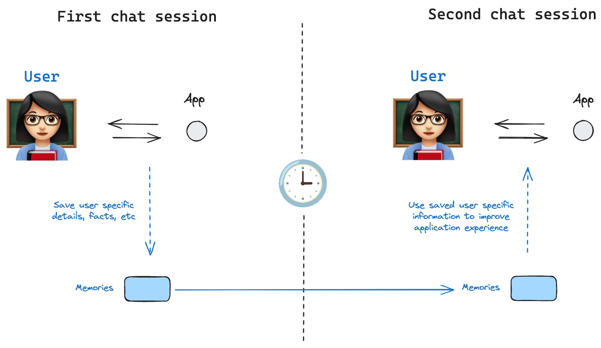
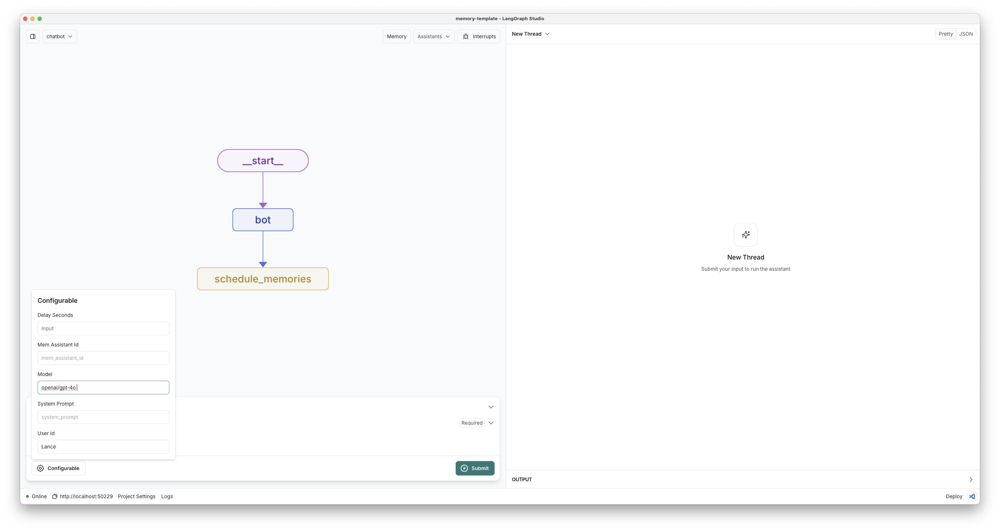
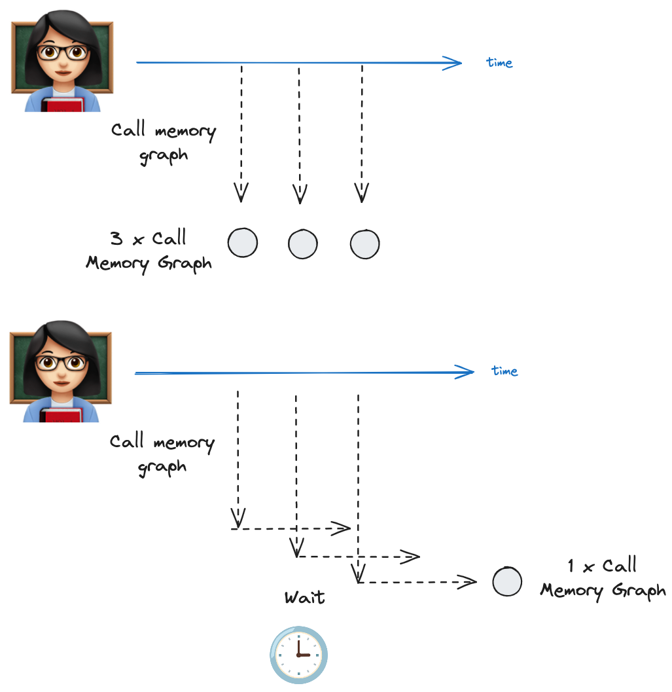
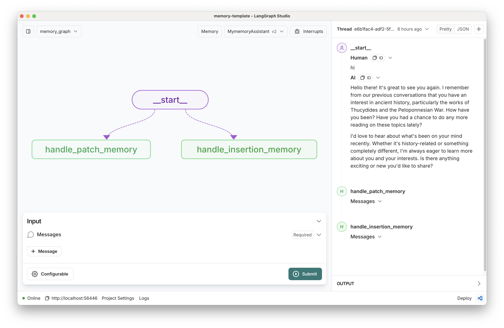
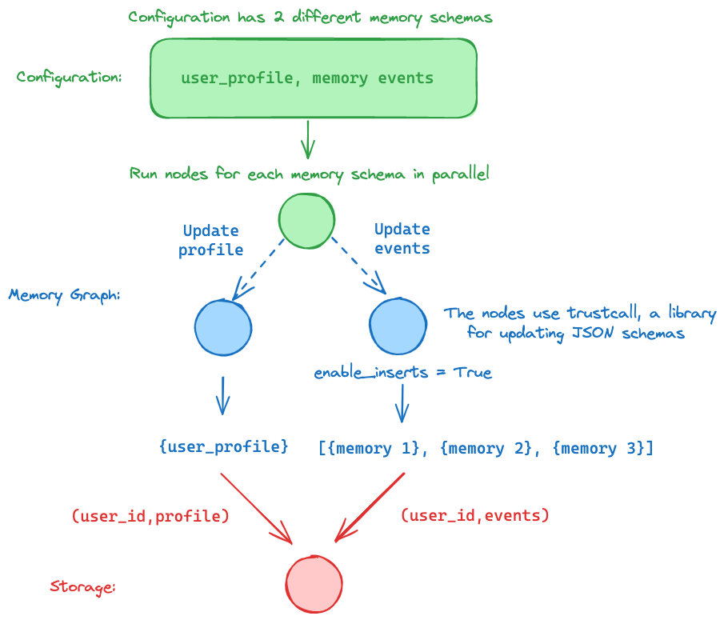
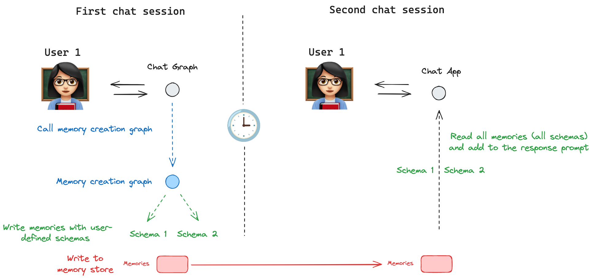
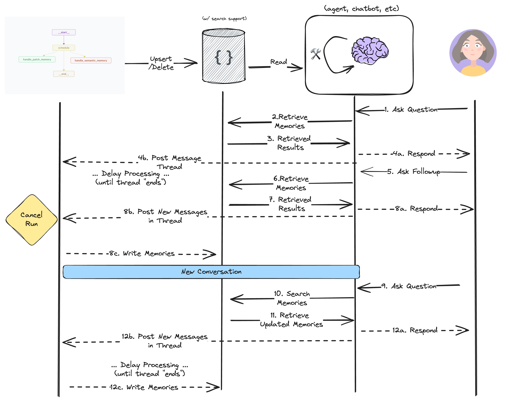

# LangGraph Memory Service

[](https://github.com/langchain-ai/memory-template/actions/workflows/unit-tests.yml)
[](https://github.com/langchain-ai/memory-template/actions/workflows/integration-tests.yml)
[![Open in - LangGraph Studio](https://img.shields.io/badge/Open_in-LangGraph_Studio-00324d.svg?logo=data:image/svg%2bxml;base64,PHN2ZyB4bWxucz0iaHR0cDovL3d3dy53My5vcmcvMjAwMC9zdmciIHdpZHRoPSI4NS4zMzMiIGhlaWdodD0iODUuMzMzIiB2ZXJzaW9uPSIxLjAiIHZpZXdCb3g9IjAgMCA2NCA2NCI+PHBhdGggZD0iTTEzIDcuOGMtNi4zIDMuMS03LjEgNi4zLTYuOCAyNS43LjQgMjQuNi4zIDI0LjUgMjUuOSAyNC41QzU3LjUgNTggNTggNTcuNSA1OCAzMi4zIDU4IDcuMyA1Ni43IDYgMzIgNmMtMTIuOCAwLTE2LjEuMy0xOSAxLjhtMzcuNiAxNi42YzIuOCAyLjggMy40IDQuMiAzLjQgNy42cy0uNiA0LjgtMy40IDcuNkw0Ny4yIDQzSDE2LjhsLTMuNC0zLjRjLTQuOC00LjgtNC44LTEwLjQgMC0xNS4ybDMuNC0zLjRoMzAuNHoiLz48cGF0aCBkPSJNMTguOSAyNS42Yy0xLjEgMS4zLTEgMS43LjQgMi41LjkuNiAxLjcgMS44IDEuNyAyLjcgMCAxIC43IDIuOCAxLjYgNC4xIDEuNCAxLjkgMS40IDIuNS4zIDMuMi0xIC42LS42LjkgMS40LjkgMS41IDAgMi43LS41IDIuNy0xIDAtLjYgMS4xLS44IDIuNi0uNGwyLjYuNy0xLjgtMi45Yy01LjktOS4zLTkuNC0xMi4zLTExLjUtOS44TTM5IDI2YzAgMS4xLS45IDIuNS0yIDMuMi0yLjQgMS41LTIuNiAzLjQtLjUgNC4yLjguMyAyIDEuNyAyLjUgMy4xLjYgMS41IDEuNCAyLjMgMiAyIDEuNS0uOSAxLjItMy41LS40LTMuNS0yLjEgMC0yLjgtMi44LS44LTMuMyAxLjYtLjQgMS42LS41IDAtLjYtMS4xLS4xLTEuNS0uNi0xLjItMS42LjctMS43IDMuMy0yLjEgMy41LS41LjEuNS4yIDEuNi4zIDIuMiAwIC43LjkgMS40IDEuOSAxLjYgMi4xLjQgMi4zLTIuMy4yLTMuMi0uOC0uMy0yLTEuNy0yLjUtMy4xLTEuMS0zLTMtMy4zLTMtLjUiLz48L3N2Zz4=)](https://langgraph-studio.vercel.app/templates/open?githubUrl=https://github.com/langchain-ai/memory-template)

## Motivation

[Memory](https://langchain-ai.github.io/langgraph/concepts/memory/) lets your AI applications learn from each user interaction. It lets them become effective as they adapt to users' personal tastes and even learn from prior mistakes. This template shows you how to build and deploy a long-term memory service that you can connect to from any LangGraph agent so they can manage user-scoped memories.



## Quickstart

Create a `.env` file.

```bash
cp .env.example .env
```

Set the required API keys in your `.env` file.

<!--
Setup instruction auto-generated by `langgraph template lock`. DO NOT EDIT MANUALLY.
-->

### Setup Model

The defaults values for `model` are shown below:

```yaml
model: anthropic/claude-3-5-sonnet-20240620
```

Follow the instructions below to get set up, or pick one of the additional options.

#### Anthropic

To use Anthropic's chat models:

1. Sign up for an [Anthropic API key](https://console.anthropic.com/) if you haven't already.
2. Once you have your API key, add it to your `.env` file:

```
ANTHROPIC_API_KEY=your-api-key
```

#### OpenAI

To use OpenAI's chat models:

1. Sign up for an [OpenAI API key](https://platform.openai.com/signup).
2. Once you have your API key, add it to your `.env` file:

```
OPENAI_API_KEY=your-api-key
```

<!--
End setup instructions
-->

### Try it out

[Open this template](https://langgraph-studio.vercel.app/templates/open?githubUrl=https://github.com/langchain-ai/memory-template) in LangGraph studio to get started and navigate to the `chatbot` graph.

_If you want to deploy to the cloud, [follow these instructions to deploy this repository to LangGraph Cloud](https://langchain-ai.github.io/langgraph/cloud/) and use Studio in your browser._



Try chatting with the bot! It will try to save memories locally (on your desktop) based on the content you tell it. For instance, if you say "Hi I'm will and I like to hike.", it will treat that content as worthy of remembering.

If you pause the conversation for ~10-20 seconds, the long-term-memory graph will start. You can click the "Memories" button at the top of your studio (if you've updated your app to a recent version) to see what's been inferred.

Create a _new_ thread using the `+` icon and chat with the bot again.

The bot should have access to the memories you've saved, and will use them to personalize its responses.

## How it works

An effective memory service should address some key questions:

1. When should memories be formed?
2. What should each memory contain?
3. How should memories be updated?

The "correct" answer to these questions can be application-specific. We'll address these challenges below, and explain how this template lets you flexibly
configure what and how memories are managed to keep your bot's memory on-topic and up-to-date. First, we'll talk about how you configure "what each memory should contain" using memory schemas.

### When to save memories

Our memory service uses **debouncing** to store information efficiently. Instead of processing memories every time the user messages your chat bot, which could be costly and redundant, we delay updates.

Here's how debouncing works in this template:

1. After each chatbot response, the graph schedules memory updates for a future time using the LangGraph SDK's `after_seconds` parameter.
2. If the chatbot receives another message within this scheduled interval, the initial update is **cancelled.**
3. A **new** memory update request is then scheduled based on the most recent interaction.

This method processes memories after a period of inactivity, likely signaling the end of a conversation segment. It balances timely memory formation with computational efficiency, avoiding unnecessary processing during rapid exchanges.

Debouncing allows us to maintain up-to-date memories without overwhelming our system or incurring excessive costs.

See this in the code here: [chatbot/graph.py](./src/chatbot/graph.py).



### What to store in memories

Next we need to tell our system what information to track. Memory schemas tell the service the "shape" of individual memories and how to update them. You can define any custom memory schema by providing `memory_types` as configuration. Let's review the [two default schemas](./src/memory_graph/configuration.py) we've provided along the template to get a better sense of what they are doing.

The first schema is the `User` profile schema, copied below:

```json
{
  "name": "User",
  "description": "Update this document to maintain up-to-date information about the user in the conversation.",
  "update_mode": "patch",
  "parameters": {
    "type": "object",
    "properties": {
      "user_name": {
        "type": "string",
        "description": "The user's preferred name"
      },
      "age": {
        "type": "integer",
        "description": "The user's age"
      },
      "interests": {
        "type": "array",
        "items": { "type": "string" },
        "description": "A list of the user's interests"
      },
      "home": {
        "type": "string",
        "description": "Description of the user's home town/neighborhood, etc."
      },
      "occupation": {
        "type": "string",
        "description": "The user's current occupation or profession"
      },
      "conversation_preferences": {
        "type": "array",
        "items": { "type": "string" },
        "description": "A list of the user's preferred conversation styles, pronouns, topics they want to avoid, etc."
      }
    }
  }
}
```

The schema has a name and description, as well as JSON schema parameters that are all passed to an LLM. The LLM infers the values for the schema based on the conversations you send to the memory service.

The schema also has an `update_mode` parameter that defines **how** the service should update its memory when new information is provided. The **patch** update_mode instructs the graph that we should always have a single JSON object to represent this user. We'll describe this in more detail in the [patch updates](#patch) section below.

The second memory schema we provide is the **Note** schema, shown below:

```json
{
  "name": "Note",
  "description": "Save notable memories the user has shared with you for later recall.",
  "update_mode": "insert",
  "parameters": {
    "type": "object",
    "properties": {
      "context": {
        "type": "string",
        "description": "The situation or circumstance where this memory may be relevant. Include any caveats or conditions that contextualize the memory. For example, if a user shares a preference, note if it only applies in certain situations (e.g., 'only at work'). Add any other relevant 'meta' details that help fully understand when and how to use this memory."
      },
      "content": {
        "type": "string",
        "description": "The specific information, preference, or event being remembered."
      }
    },
    "required": ["context", "content"]
  }
}
```

Just like the previous example, this schema has a name, description, and parameters. Notic that the `update_mode` this time is "insert". This instructs the LLM in the memory service to **insert new memories to the list or update existing ones**. The number of memories for this `update_mode` is **unbound** since the model can continue to store new notes any time something interesting shows up in the conversation. Each time the service runs, the model can generate multiple schemas, some to update or re-contextualize existing memories, some to document new information. Note that these memory schemas tend to have fewer parameters and are usually most effective if you have a field to let the service provide contextual information (so that if your bot fetches this memory, it isn't taken out-of-context).

To wrap up this section: `memory_schemas` provide a name, description, and parameters that the LLM populates to store in the database. The `update_mode` controls whether new information should always overwrite an existing memory or whether it should insert new memories (while optionally updating existing ones).

These schemas are fully customizable! Try extending the above and seeing how it updates memory formation in the studio by passing in via configuration (or defining in an assistant).

### Handling memory updates

In the previous section we showed how the memory schemas define how memories should be updated with new information over time. Let's now turn our attention to _how_ new information is handled. Each update type using tool calling in slightly different ways. We will use the [`trustcall` library](https://github.com/hinthornw/trustcall), which we created as a simple interface for generating and continuously updating json documents, to handle all of the cases below:

#### patch

The "patch" `update_mode` defines a memory management strategy that repeatedly updates a single JSON document. When new information is provided, the model generates "patches" - small updates to extend, delete, or replace content in the current memory document. This "patch" `update_mode` offers three key benefits:

1. It provides strict visibility into a user's representation at any given point (seeing the memory is a single GET operation).
2. It allows end users to directly view and update their own representation for the bot.
3. It is easier to demarcate what should and shouldn't be persisted across conversations.

By defining specific parameters in the schema, we deliberately choose what information is relevant to track, excluding other potentially distracting information. This approach biases the service to focus on what we deem important for our specific application.

The memory update process works as follows:

1. If no memory exists:

   - `trust_call` prompts the model to populate the document.
   - It performs schema validation to ensure the output is correct.

2. If a memory already exists:
   - Instead of regenerating the entire schema (which can lead to information loss), we provide the LLM with a `PatchDoc` tool
   - The memory schema is placed in the system prompt but is not made available as a tool for the model to call.
   - Patches are applied to the existing memory, and the resulting document is validated to maintain schema compliance.

By applying updates as JSON patches, we achieve several benefits:

- Minimized information loss
- Reduced token costs
- Simplified memory management

This approach is particularly effective for large, complicated schemas, where LLMs might otherwise forget or omit previously stored details when regenerating information from scratch.

#### insert

The "insert" `update_mode` lets you manage a growing collection of memories or notes, rather than a single, continuously updated document. This approach is particularly useful for tracking multiple, distinct pieces of information that accumulate over time, such as user preferences, important events, or contextual details that may be relevant in future interactions.

When handling memory creation and updates with the "insert" mode, the process works as follows:

1. When no memories exist:

   - The model is provided with a single tool: the schema from your memory configuration.
   - It uses multi-tool calling to generate zero or more instances of your schema, based on the conversation context.

2. When memories exist for the user:
   - The memory graph searches for existing memories to provide additional context.
   - These existing memories are included in the system prompt.
   - Two tools are made available to the model:
     a. Your memory schema tool
     b. A "PatchDoc" tool
   - The LLM is prompted to invoke the appropriate tools based on the conversational context.
   - The LLM can:
     a. Call the PatchDoc tool to update existing memories that are incorrect or that can benefit from additional context.
     b. Call your memory schema tool multiple times to save new memories or notes.
   - All tool calls occur in a single generation step.
   - The graph then upserts (inserts or updates) the results to the memory store.

This approach allows for flexible memory management, enabling both updates to existing memories and the creation of new ones as needed.
The frequency of updates vs. inserts depends both on the LLM you use, the schema descriptions you provide, and on how you prompt the model in context. We encourage you to look at the LangSmith traces the memory graph generates and develop evaluations to strike the right balance of precision and recall.



### Memory storage

All these memories need to go somewhere reliable. All LangGraph deployments come with a built-in memory storage layer that you can use to persist information across conversations.

You can learn more about Storage in LangGraph [here](https://langchain-ai.github.io/langgraph/how-tos/memory/shared-state/).

In our case, we are saving all memories namespaced by `user_id` and by the memory schema you provide. That way you can easily search for memories for a given user and of a particular type. This diagram shows how these pieces fit together:



### Calling the memory service

The studio uses the LangGraph API as its backend and exposes graph endpoints for all the graphs defied in your `langgraph.json` file.

```json
    "graphs": {
        "chatbot": "./src/chatbot/graph.py:graph",
        "memory_graph": "./src/memory_graph/graph.py:graph"
    },
```

You can interact with your server and storage using the studio UI or the LangGraph SDK.

```python
from langgraph_sdk import get_client
client = get_client(url="http:...") # your server
items = await client.store.search_items(namespace)
```



## Benefits

The separation of concerns between the application logic (chatbot) and the memory (the memory graph) a few advantages:

(1) minimal overhead by removing memory creation logic from the hotpath of the application (e.g., no latency cost for memory creation)

(2) memory creation logic is handled in a background job, separate from the chatbot, with scheduling to avoid duplicate processing

(3) memory graph can be updated and / or hosted (as a service) independently of the application (chatbot)

Here is a schematic of the interaction pattern:



## How to evaluate

Memory management can be challenging to get right. To make sure your memory_types suit your applications' needs, we recommend starting from an evaluation set, adding to it over time as you find and address common errors in your service.

We have provided a few example evaluation cases in [the test file here](./tests/integration_tests/test_graph.py). As you can see, the metrics themselves don't have to be terribly complicated, especially not at the outset.

We use [LangSmith's @unit decorator](https://docs.smith.langchain.com/how_to_guides/evaluation/unit_testing#write-a-test) to sync all the evaluations to LangSmith so you can better optimize your system and identify the root cause of any issues that may arise.

## How to customize

Customize memory memory_types: This memory graph supports two different `update_modes` that dictate how memories will be managed:

1. Patch Schema: This allows updating a single, continuous memory schema with new information from the conversation. You can customize the schema for this type by defining the JSON schema when initializing the memory schema. For instance, try changing the "User" schema to add a new field `favorite_locations`:

```json
[
  {
    "name": "User",
    "description": "Update this document to maintain up-to-date information about the user in the conversation.",
    "update_mode": "patch",
    "parameters": {
      "type": "object",
      "properties": {
        "user_name": {
          "type": "string",
          "description": "The user's preferred name"
        },
        "age": {
          "type": "integer",
          "description": "The user's age"
        },
        "interests": {
          "type": "array",
          "items": { "type": "string" },
          "description": "A list of the user's interests"
        },
        "home": {
          "type": "string",
          "description": "Description of the user's home town/neighborhood, etc."
        },
        "occupation": {
          "type": "string",
          "description": "The user's current occupation or profession"
        },
        "conversation_preferences": {
          "type": "array",
          "items": { "type": "string" },
          "description": "A list of the user's preferred conversation styles, pronouns, topics they want to avoid, etc."
        },
        "favorite_locations": {
          "type": "array",
          "items": { "type": "string" },
          "description": "A list of the user's favorite places or locations"
        }
      }
    }
  }
]
```

If you paste the above in the "Memory Types" configuration in the Studio UI and continue the chat, new memories will be extracted to follow the updated schema.

You can modify existing schemas or provide **new** ones via configuration to customize the memory structures extracted by the memory graph. Here's how it works:

- Memory schemas are grouped by "name".
- If you update an existing schema (e.g., "User"):
  - It won't automatically update or migrate existing memories in the database.
  - The new schema will be applied to all newly extracted memories.
  - When updating existing memories, the LLM will validate and "migrate" the data based on the new schema while applying updates.
- If you create a new schema with a different name:
  - It will be saved under a separate namespace.
  - This ensures no collisions with existing memories.

2. Insertion Schema: This allows inserting individual "event" memories, such as key pieces of information or summaries from the conversation. You can define custom memory_types for these event memories by providing a JSON schema when initializing the InsertionMemorySchema. Let's add a new insertion schema to track each "Person" the user mentions:

```json
[
  {
    "name": "Person",
    "description": "Track general information about people the user knows.",
    "update_mode": "insert",
    "parameters": {
      "type": "object",
      "properties": {
        "name": {
          "type": "string",
          "description": "The name of the person."
        },
        "relationship": {
          "type": "string",
          "description": "The relationship between the user and this person (e.g., friend, family, colleague)."
        },
        "notes": {
          "type": "string",
          "description": "General notes about this person, including how they met, user's feelings, and recent interactions."
        }
      },
      "required": ["name"]
    }
  }
]
```

Since you've made a newly named memory schema, the memory service will save it within a new namespace and **not** overwrite any previous ones.

You can modify schemas with an insertion update_mode in the same way as schemas with a patch update_mode. Define the structure, name it descriptively, set "update_mode" to "insert", and include a concise description. Parameters should have appropriate data types and descriptions. Consider adding constraints for data quality.

3. Select a different model: We default to anthropic/claude-3-5-sonnet-20240620. You can select a compatible chat model using provider/model-name via configuration. Example: openai/gpt-4.
4. Customize the prompts: We provide default prompts in the graph definition. You can easily update these via configuration.

We'd also encourage you to extend this template by adding additional memory types! "Patch" and "insert" are incredibly powerful already, but you could also extend the logic to add more reflection over related memories to build stronger associations between the saved content. Make the code your own!

<!--
Configuration auto-generated by `langgraph template lock`. DO NOT EDIT MANUALLY.
{
  "config_schemas": {
    "chatbot": {
      "type": "object",
      "properties": {}
    },
    "memory_graph": {
      "type": "object",
      "properties": {
        "model": {
          "type": "string",
          "default": "anthropic/claude-3-5-sonnet-20240620",
          "description": "The name of the language model to use for the agent. Should be in the form: provider/model-name.",
          "environment": [
            {
              "value": "anthropic/claude-1.2",
              "variables": "ANTHROPIC_API_KEY"
            },
            {
              "value": "anthropic/claude-2.0",
              "variables": "ANTHROPIC_API_KEY"
            },
            {
              "value": "anthropic/claude-2.1",
              "variables": "ANTHROPIC_API_KEY"
            },
            {
              "value": "anthropic/claude-3-5-sonnet-20240620",
              "variables": "ANTHROPIC_API_KEY"
            },
            {
              "value": "anthropic/claude-3-haiku-20240307",
              "variables": "ANTHROPIC_API_KEY"
            },
            {
              "value": "anthropic/claude-3-opus-20240229",
              "variables": "ANTHROPIC_API_KEY"
            },
            {
              "value": "anthropic/claude-3-sonnet-20240229",
              "variables": "ANTHROPIC_API_KEY"
            },
            {
              "value": "anthropic/claude-instant-1.2",
              "variables": "ANTHROPIC_API_KEY"
            },
            {
              "value": "openai/gpt-3.5-turbo",
              "variables": "OPENAI_API_KEY"
            },
            {
              "value": "openai/gpt-3.5-turbo-0125",
              "variables": "OPENAI_API_KEY"
            },
            {
              "value": "openai/gpt-3.5-turbo-0301",
              "variables": "OPENAI_API_KEY"
            },
            {
              "value": "openai/gpt-3.5-turbo-0613",
              "variables": "OPENAI_API_KEY"
            },
            {
              "value": "openai/gpt-3.5-turbo-1106",
              "variables": "OPENAI_API_KEY"
            },
            {
              "value": "openai/gpt-3.5-turbo-16k",
              "variables": "OPENAI_API_KEY"
            },
            {
              "value": "openai/gpt-3.5-turbo-16k-0613",
              "variables": "OPENAI_API_KEY"
            },
            {
              "value": "openai/gpt-4",
              "variables": "OPENAI_API_KEY"
            },
            {
              "value": "openai/gpt-4-0125-preview",
              "variables": "OPENAI_API_KEY"
            },
            {
              "value": "openai/gpt-4-0314",
              "variables": "OPENAI_API_KEY"
            },
            {
              "value": "openai/gpt-4-0613",
              "variables": "OPENAI_API_KEY"
            },
            {
              "value": "openai/gpt-4-1106-preview",
              "variables": "OPENAI_API_KEY"
            },
            {
              "value": "openai/gpt-4-32k",
              "variables": "OPENAI_API_KEY"
            },
            {
              "value": "openai/gpt-4-32k-0314",
              "variables": "OPENAI_API_KEY"
            },
            {
              "value": "openai/gpt-4-32k-0613",
              "variables": "OPENAI_API_KEY"
            },
            {
              "value": "openai/gpt-4-turbo",
              "variables": "OPENAI_API_KEY"
            },
            {
              "value": "openai/gpt-4-turbo-preview",
              "variables": "OPENAI_API_KEY"
            },
            {
              "value": "openai/gpt-4-vision-preview",
              "variables": "OPENAI_API_KEY"
            },
            {
              "value": "openai/gpt-4o",
              "variables": "OPENAI_API_KEY"
            },
            {
              "value": "openai/gpt-4o-mini",
              "variables": "OPENAI_API_KEY"
            }
          ]
        }
      }
    }
  }
}
-->
